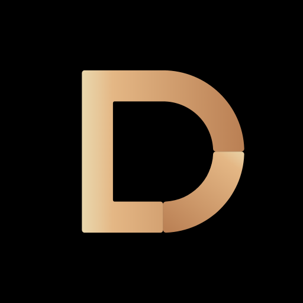
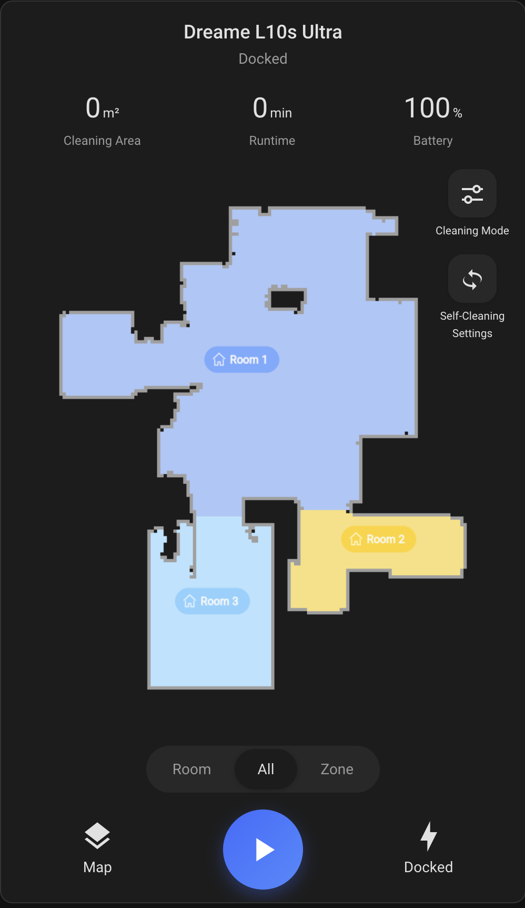

# Dreame Vacuum Card

<p align="center"></p>

<p align="center"></p>

## Support this project

[](https://github.com/sponsors/craibo)
[](https://paypal.me/craibo?country.x=AU&locale.x=en_AU)

---

A Lovelace card for the [`dreame_vacuum`](https://github.com/Tasshack/dreame-vacuum) integration, laid out like the Dreame app. It uses only the integration's public entities, attributes and services, and has no build step.

- Header with state, plus cleaning area, runtime and battery
- Live map from the integration's camera, with room labels and drag-to-draw zones
- Room / All / Zone modes, cleaning times, start / pause, return to dock
- Cleaning Mode sheet: mode, suction, mop dampness, customized cleaning
- Cleaning sequence: Cleaning Mode sheet → Cleaning Sequence, tap rooms in order, Done
- Per-room custom cleaning: with Customized Cleaning on, long-press a room (or select it and tap Room Settings) to set mode, suction, water, repeats
- Map editor (pencil button): draw/delete virtual walls, no-go and no-mop zones; merge, split and rename rooms; a backup is offered before changes
- Map management: rename, back up, restore and delete maps, and save/discard/replace a new map
- Maintenance sheet (a red dot and a dismissible banner flag low parts): life remaining and time left for brushes, filter, mop pad, sensors, silver ion and detergent, with a confirmed reset button for each; a Base Station tab shows dust, auto-empty, wash base, water, mop pad and error status with auto-empty, drain-tank and clear-warning buttons
- Self-Cleaning sheet: clean mop pad, dry mop pad, auto-empty

## Install

### HACS (custom repository)

1. HACS → ⋮ → Custom repositories → add `https://github.com/craibo/ha-dreame-vacuum-card`, type **Dashboard**.
2. Install **Dreame Vacuum Card** and reload the browser.

### Manual

1. Copy `ha-dreame-vacuum-card.js` to `config/www/`.
2. Add it as a dashboard resource: `/local/ha-dreame-vacuum-card.js` (type: JavaScript module).

## Config

```yaml
type: custom:dreame-vacuum-card
entity: vacuum.l10s_ultra
# optional
camera: camera.l10s_ultra_map
name: L10s Ultra
show_maintenance: true          # false hides the Maintenance button
maintenance_warn_percent: 10    # red at or below this, amber up to 3x
entities:            # override auto-discovery of any sibling entity
  suction_level: select.l10s_ultra_suction_level
```

Sibling entities (selects, switches, buttons, sensors) are found automatically on the vacuum's device by `translation_key`. Keys you can override are listed in `ENTITY_KEYS` in the JS file.

## Services used

`dreame_vacuum.vacuum_clean_segment` (rooms), `dreame_vacuum.vacuum_clean_zone` (zones), the map editor's `vacuum_set_restricted_zone`, `vacuum_merge_segments`, `vacuum_split_segments`, `vacuum_rename_segment`, and the map services `vacuum_rename_map`, `vacuum_backup_map`, `vacuum_restore_map`, `vacuum_delete_map` and the temporary-map services, plus the standard `vacuum.start`, `vacuum.pause`, `vacuum.return_to_base`, `select.select_option`, `button.press` and `homeassistant.toggle`.

## Not yet implemented

Real-time camera (the integration doesn't expose it), carpets and thresholds editing, and moving/resizing existing zones. See `PLAN.md`.
